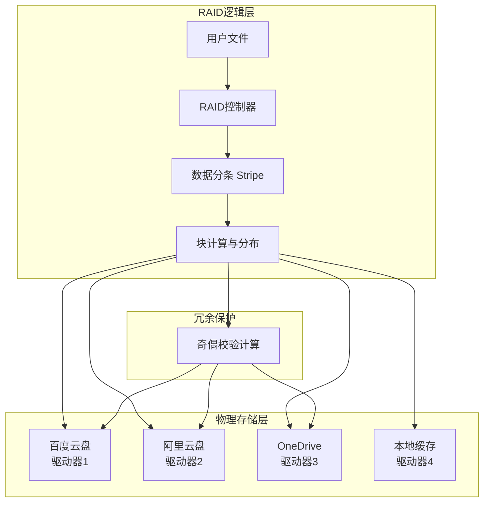

# RaidOverYunPan (技术方案目前还在初步构思中)

**RaidOverYunPan：一个通过Raid技术，将文件分布式存储于多个网盘，以实现极致下载加速的开源分布式文件系统。**

> **分而存之，合而加速。 | Scatter the Chunks, Unite the Speed.**

---

## 📖 项目简介

**RaidOverYunPan** 是一个创新的、个人级的开源存储网关。它的核心使命是：**利用Raid的思想，打破你对单一网盘的依赖与速度枷锁。**

你是否曾受限于单个网盘的速度？PanMatrix 提供了终极解决方案。通过将大文件**分块**并**分布式**地存储 across multiple cloud drives (如百度网盘、阿里云盘、OneDrive 等)，PanMatrix 在下载时能够从多个来源并行获取数据块，智能合并为完整文件，从而实现下载速度的**数量级提升**。本质上，您正在用多个免费的网盘，为自己构建一个高性能、高可用的“私有存储矩阵”。

## ✨ 核心特性

- **⚡ 极致并行加速**：聚合多个网盘的下载带宽，实现并行下载，理论上速度可达单个网盘的 N 倍。
- **🔩 智能文件分块**：将大文件透明地分割成标准数据块，分散存储，有效规避单点故障和厂商限速策略。
- **🌐 分布式存储池**：采用类 RAID 的分布式策略，将数据块存储 across different clouds，提升数据可靠性。
- **🔒 统一管理界面**：提供一个简洁的本地客户端或命令行工具，统一管理所有分散在云端的数据，如同操作一个本地磁盘。
- **🛡️ 元数据安全**：所有文件块映射关系等元数据均存储在本地，由您完全掌控。
- **🚧 (规划中) 数据冗余**：支持擦除编码等冗余算法，即使部分网盘文件丢失，也能确保数据完整恢复。

## 🏗️ 技术架构

PanMatrix 的核心工作流程如下，它展示了文件从上传到下载的完整生命周期：

1.  **上传流程**：文件被智能地分割成小块，元数据记录在本地，数据块被并行上传到不同的网盘。
2.  **下载流程**：根据本地元数据，从多个网盘并行下载所有数据块，校验完整性后合并为原始文件。
3.  **元数据管理**：本地轻量级数据库是系统的“大脑”，负责记录文件与块的映射关系，确保数据可追溯和恢复。

## 🚀 快速开始

### 前置要求
### 📦 安装与配置
### 🎯 使用示例
## 🤝 如何贡献

我们热烈欢迎任何形式的贡献！无论是代码、文档、想法还是 Bug 报告。

1.  Fork 本仓库
2.  创建您的特性分支 (`git checkout -b feature/AmazingFeature`)
3.  提交您的更改 (`git commit -m 'Add some AmazingFeature'`)
4.  推送到分支 (`git push origin feature/AmazingFeature`)
5.  开启一个 Pull Request

## 📄 许可证

版权所有 (c) 2024 PanMatrix 贡献者。

本项目采用 **GNU Affero General Public License v3.0** 许可证 - 查看 [LICENSE](LICENSE) 文件了解详情。

此严格的 Copyleft 许可证旨在确保：
1.  **自由使用和修改**：任何人都可以自由地使用、修改和分发本软件。
2.  **开源回馈**：任何基于本项目的**修改或衍生作品，在通过网络提供服务或以其他方式分发时，都必须以相同的许可证完全开源**。
3.  **禁止闭源商用**：此协议 effectively 阻止了他人将本项目或其衍生作品用于闭源的商业产品中。

## 💡 灵感与致谢

- 灵感来源于 HDFS、RAID 技术及现代分布式系统理论。
- 感谢所有为本项目提供思路和代码的开源项目。
- 特别感谢所有未来的贡献者。

## ❓ 常见问题

**Q: 这违反网盘的服务条款吗？**  
A: 使用公开 API 通常是被允许的，但请务必阅读您所用网盘的具体条款。本项目旨在技术探索与提升个人用户体验，请勿用于任何违规用途。

**Q: 我的数据安全吗？**  
A: 元数据（文件-块映射关系）存储在本地，请妥善保管。文件本身以分块形式存储在各网盘，目前未做全局加密（此为计划功能）。对于敏感数据，建议先自行加密再上传。

**Q: 如果其中一个网盘的服务不可用了怎么办？**  
A: 只要您本地元数据完好，并且有足够的数据块（在启用冗余功能后，甚至不需要全部块）可供下载，文件就可以恢复。这正是分布式存储的优势。

**Q: 我最多可以添加多少个网盘？**  
A: 从技术上讲没有硬性上限，但受限于本地客户端的管理和调度能力。通常接入 3-5 个网盘即可获得显著的速度和可靠性提升。

---

**如果 RaidOverYunPan 让您看到了突破存储限制的曙光，请给我们一个 ⭐️ Star！这是支持我们持续开发的最大动力。**
